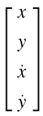
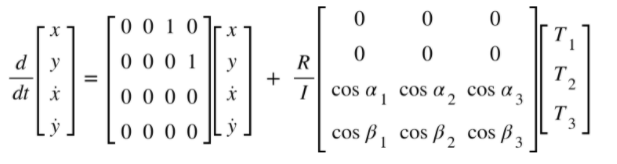
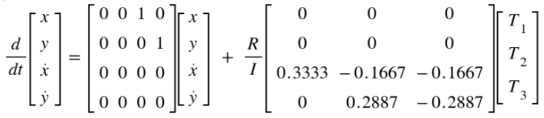
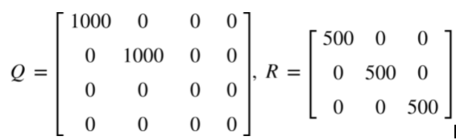
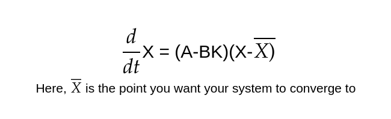

# Controlling 
***
#### To make the testing of our Control algorithms easier, we considered a spherical ball representing holonomic degrees of freedom for our bot.

The State matrix can be expressed as 
<p align="center">
    
</p>

### Dynamics of the simplified model

The State Equation can be expressed as 
<p align="center">
    
</p>
Where alphas and betas are the angles of axis of torques with the base x and y axes. and T standing for torques are our actuations. R represents the radius of the bot and I its moment of inertia

For our simplified model, we have used Linear Quadratic Regulator or LQR controller. This is because our system is already linear and also with robust nature of LQR controllers.

For our final robot design, we will be using Model Predictive Control,work is in progress for that.

#### Linear Quadratic Regulator

Considering the placement of our actuators and Dynamics of the system, The State Equation will look like

<p align="center">
 
 <p align="center">
 <i>State Equation considering the wheel placements</i><br> 
</p>

The cost Matrix for State Q and the cost Matrix for Actuators R were experimently observed to be 

<p align="center">
 
 <p align="center">
</p>

Feeding these to the  controlller_LQR function from controlpy library, we get the bestfitting Eigen value Matrix K for the system to converge to fed the target value.

<p align="center">
 
 <p align="center">
 <i>Final Control equation</i><br> 
</p>

by setting the value of X_bar, we can make the system(or bot) converge to our desired state (or position).

## Following a Mathematical curve 

To make the bot follow a nathematical curve, we can simpily pass the desired equation (preferably passing through origin), split it into various points and then updating the next target point once the bot has converged to the one immediately before it. 

Following piece of code in [curve_following_pos-control.py](kinematicsSim/curve_following_pos-control.py) takes care of it

```
if(disp < 0.1):
    target_x += 0.5                         # updating the next state
    target_y = target_function(target_x)    # y as given function of x
```
Here we took the step for x = 0.5 as it gives decent accuracy while following given curve.

The desired curve to be followed can be changed from here 

```
    def target_function(x):      # Return the equation of desired curve, passing through origin
        return 2*np.sin(x)
```


# Results
***
## Achieved Objectives 
### A fully functional urdf file for our imporvised mechanism. 
The designed urdf file is completely ready and can be used for Simulation in pybullet or in any other simulation software with a few tweaks.

* Simulation with the Internal driving unit fixed 

https://user-images.githubusercontent.com/75927242/152683211-b4be53bd-7ec0-4552-bbc6-cfe37ffccaf4.mp4

* Simulaltion with the bot free, WITHOUT any proper controller. The work is in progress for it.

https://user-images.githubusercontent.com/75927242/152683170-45838170-e293-4642-afdc-fee81c785365.mp4

### Linear Qudratic Regulator for accurate path following
We Have designed two controllers for Path following using LQR control.
* Path following using the current position as the state vector. Video is attached below. Herethe controller was told to follow a sine curve At the end it can be observed that it traces the desired path upto high accuracy.
* Path following using the current velocity as the state vector. Needs a bit more work.

#### Curve Following using position in 3D space as state
https://user-images.githubusercontent.com/75927242/152682768-76f656b1-9296-49bc-9216-b5136866597f.mp4


# References
***
[Playlist on Controls by Steve Brunton](https://youtu.be/1_UobILf3cc)


