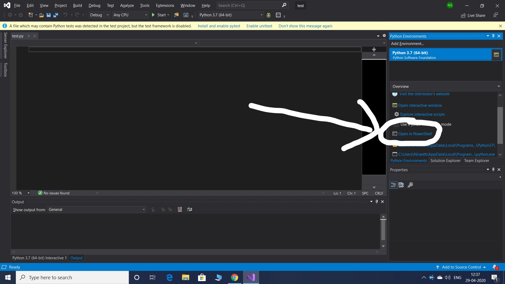

# Gyrosphere - The Spherical Bot 

<hr/>

## Introduction
Gyrosphere is a **ball-shaped** mobile robot with spherical external shape typically made of a spherical shell serving as the body of the robot and an internal driving unit (IDU) that enables the robot to move. Gyrosphere typically moves by rolling over surfaces. The rolling motion is commonly performed by changing the robot's center of mass (i.e., pendulum-driven system).

## Table of Contents
- Setting up the Environment
- Pybullet Installation
- Model of Gyrosphere
- Algorithms Used
- Simulation Results
- References

## Setting up the environment

## Pybullet Installation
Bullet is a **physics engine** that simulates **collision detection, soft and rigid body dynamics**. It has been used in video games as well as for visual effects in movies.PyBullet is an easy to use Python module for physics simulation, robotics, and deep reinforcement learning based on the Bullet Physics SDK.

Given the options, the reason for selecting PyBullet is,
* It's a lightweight software and opens source with an active community.
* Built for python development, hence gives more informative and clear approach for beginners. 
* No external dependencies except a fully working python interpreter.

Here are some simulations in PyBullet:

<p align="center">
   
</p>
<p align="center">
   
</p>
<p align="center">
   
</p>

#### Installation of PyBullet

The installation of PyBullet is as simple as:
(sudo)`pip install PyBullet` (Python 2.x), 
`pip3 install PyBullet`
This will expose the PyBullet module as well as pybullet_envs Gym environments.

If you are getting Visual C++ version issues in Windows, then

1. First of all uninstall everything you have installed till now, like any Python platform such as anaconda, jupyter, Python idle, visual studio... including visual studio basic tools and related softwares and restart the machine (Important).
2. Install Python idle v3.7.7 from [here](https://www.python.org/ftp/python/3.7.7/python-3.7.7-amd64.exe), you can go for the latest one too which is supported by your machine, but just because older versions are more compatible, here v3.7.7 is included. While installation go through default installation, kindly check mark Add to path option.
3. Install visual studio basic tools from [here](https://drive.google.com/file/d/1rhnHXYUMPnS9Z3ygkJMOJ40bkZiTSonF/view?usp=drivesdk), (approx 3MB file) Kindly use institute mail id only. This is the web based setup, this will cost you around 400mb of data, but install through this link only (Important). If you are able to successfully install visual studio basic tools then jump to step 6
4. If you get an error while installing visual studio basic tools such as .Net framework 4.5 or above is required then install it from [here](https://www.microsoft.com/en-in/download/details.aspx?id=30653). This link is for framework 4.5 you can install the latest one too, which is supported by your machine. If you don't get any error in this them jump to Step 6.
5. While installation of .Net framework, if you get error such as package is not applicable to your computer, that's mostly because service pack update is missing, or if it says that a particular update package is needed, then kindly update your windows through windows update, and try searching for that particular update package on the web, although windows update will fix this. Maybe windows update can't install all the updates in one go, so after taking updates and restarting the machine, search for updates via windows update again until you get windows is up to date message from windows update.
6. Open command prompt (cmd.exe), Type commands
   1. pip install pybullet (important)
   2. pip install wheel (if you get some wheel related error while running above command)
   3. pip install --upgrade pip(optional)
7. Open Python idle this will open the shell, under file tab click new, in newly opened window you can type you code and run it.

#### If the above process doesn't work for windows users then try: 

1. Install Visual Studio 2019 Community version [here](https://visualstudio.microsoft.com/downloads/).
2. In the setup, in workloads select “Python Development” and “Desktop development with C++”.
3. After installation, launch Visual Studio and create a new python project.
4. Goto Tools>Python>Python Environments.
5. In the Overview bar on the right side, select “Open in Powershell”
<p align="center">
   
</p>

6. Once your Powershell pops up, type “pip3 install PyBullet” and press enter.
7. You can install any python package using pip in the Powershell.
8. Try running this example code:
```python
import pybullet as p
import time
import pybullet_data
physicsClient = p.connect(p.GUI)#or p.DIRECT for non-graphical version
p.setAdditionalSearchPath(pybullet_data.getDataPath()) #optionally
p.setGravity(0,0,-10)
planeId = p.loadURDF("plane.urdf")
cubeStartPos = [0,0,1]
cubeStartOrientation = p.getQuaternionFromEuler([0,0,0])
boxId = p.loadURDF("r2d2.urdf",cubeStartPos, cubeStartOrientation)
for i in range (10000):
    p.stepSimulation()
    time.sleep(1./240.)
cubePos, cubeOrn = p.getBasePositionAndOrientation(boxId)
print(cubePos,cubeOrn)
p.disconnect()
```
